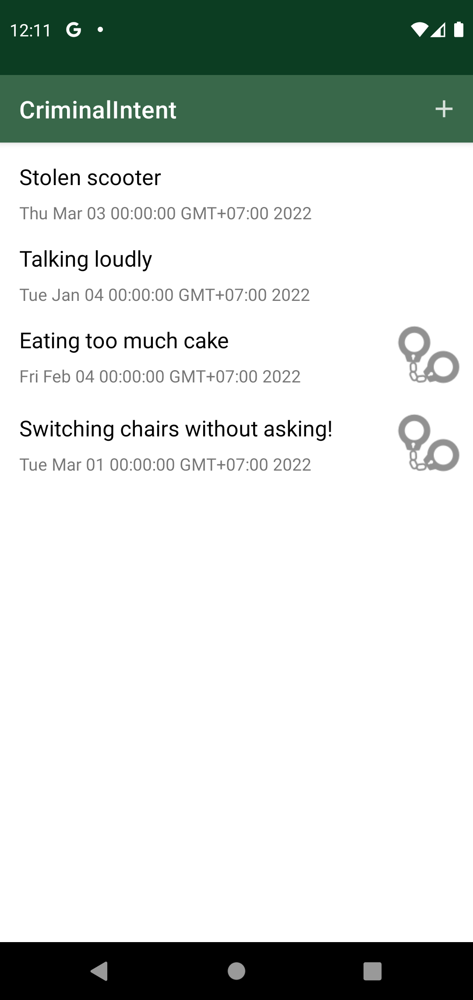
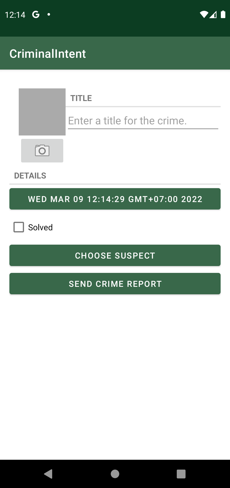
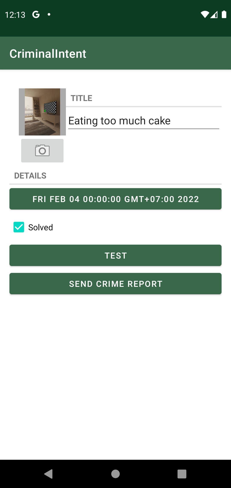
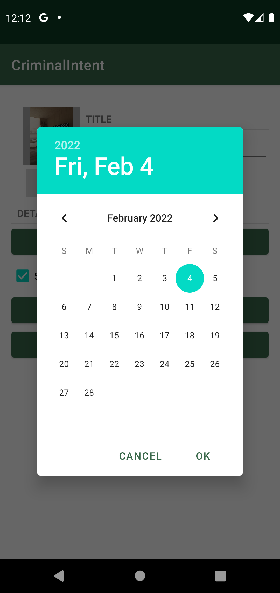
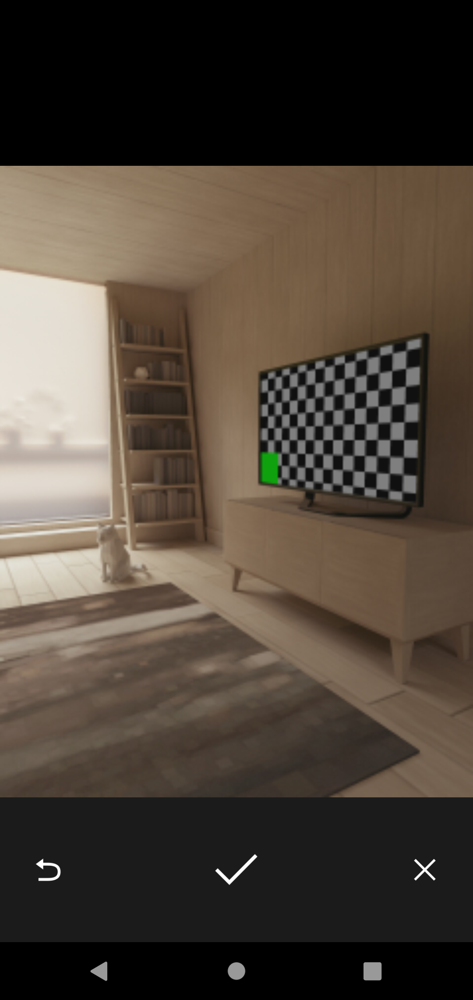

App: Criminal Intent
======================

# Overview
***Reference***: BNR book, Chapter 8

***CriminalIntent*** records the details of "office crimes" – things like leaving dirty dishes in the break room sink or walking away
from an empty shared printer after documents have printed.

With CriminalIntent, you can make a record of a crime including a title, a date, and a photo. You
can also identify a suspect from your contacts and lodge a complaint via email, Twitter, Facebook,
or another app. After documenting and reporting a crime, you can proceed with your work free of
resentment and ready to focus on the business at hand.

CriminalIntent is a complex app that will take 11 chapters to complete. It will have a list-detail
interface: The main screen will display a list of recorded crimes, and users will be able to add new
crimes or select an existing crime to view and edit its details (Figure 8.1)

# Screen shots demo
Below are the selected screenshots that demonstrate the features of the app.

## Criminal list

## Criminal detail - create new

## Criminal detail - view & update

## Date picker dialog

## Sending a report

## Taking a picture using camera

# Version 1.0 
**Git branch**: `version1`

## Scope
- Chapters 8, 9
## Chapter 8
- Crime
- CrimeFragment
- MainActivity
- res/layout/activity_fragment.xml
- res/layout/fragment_crime.xml

## Chapter 9
Jetpack packages: https://developer.android.com/jetpack/androidx/versions

- CrimeListViewModel
- CrimeListFragment
- MainActivity (updated)
- res/layout/fragment_crime_list.xml
- res/layout/list_item_crime.xml

# Version 2.0
**Git branch**: `version2`

## Scope
- Chapters 10, 11

## Chapter 10
- res/layout/list_item_crime.xml: Converted to ConstraintLayout
- res/drawable/ic_solved
- CrimeListFragment: updated to use ImageView and to have customised view properties

## Chapter 11
- Room API for database access
  - Note: for SDK 30, can only use Room version <= 2.3.0
- Crime: updated with @Entity
- package `database` with 3 classes: CrimeDao, CrimeDatabase, CrimeTypeConverters
- database directory on emulator: `/data/au.edu.swin.sdmd.criminalintent/databases`
- CrimeRepository
- CriminalIntentApplication
- CrimeListViewModel, CrimeListFragment: updated to use LiveData

# Version 3.0
**Git branch**: `version3`

## Scope
- Chapters 12, 13

## Chapter 12: Fragment navigation
- CrimeDetailViewModel: load, save changed data from view to database
- CrimeListFragment, CrimeFragment, MainActivity: updated to support fragment navigation
- CrimeRepository: support update, insert
- `database.CrimeDao`: support update, insert

## Chapter 13: Dialogs
- DatePickerFragment: added
- CrimeFragment: updated to interact with DatePickerFragment to allow user pick a date
  
# Version 4.0
**Git branch**: `version4`

## Scope
- Chapters: 14,15,16

## Chapter 14: App Bar
- CriminalListFragment: added options menu in App Bar, that allows user to add a new item
- database from versions 2 & 3: removed from the emulator, to make it easier for users to view new items that they add (a fresh database is also created on the emulator with the new items)

## Chapter 15: Implicit Intent
- CrimeFragment: "choose suspect" and "send crime report"

## Chapter 16: Taking pictures with intents
- CrimeFragment: "photo" view and "take photo" button
- Configured to use camera to take photo and converts it into bitmap for display
